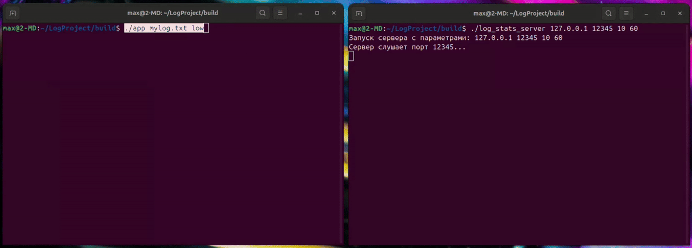

# LogProject


Это учебный проект на C++17, реализующий библиотеку для записи логов с различными уровнями важности,
а также консольные приложения для тестирования и сбора статистики.
# Установка 
```bash
# Клонировать репозиторий
git clone https://github.com/Makintosh365/LogProject.git
cd LogProject

# Создать директорию сборки и скомпилировать
mkdir build && cd build
cmake ..
make
```
# Особенности

- **Основная функциональность:** запись логов с указанием времени, уровня важности и текста сообщения в файл или через TCP-сокет. Вид сообщения: `[2025-01-02 01:02:03] [low] : hello`
- **Фильтрация по уровню важности:** можно задать минимальный уровень логирования, ниже которого сообщения игнорируются.
- **Динамическая смена уровня логирования:** менять уровень можно уже во время работы программы.
```cpp
  Logger log("mylog.txt", Level::Low);
  log.setLevel(Level::high);
```
- **Потокобезопасная запись:** все операции записи выполняются в отдельном потоке с использованием очереди.
- **Поддержка нескольких приёмников логов:** файл (обязательно), сокет (опционально) с единым интерфейсом.
- **Сервер статистики (опционально):** принимает логи по сети формат сообщения `<timestamp> <level> <message_length> <message>`, считает количество и длины сообщений, выводит статистику по событиям или таймауту.


# Начальная конфигурация
   • Если используется режим логирования в сокет:
- Убедитесь, что сервер для приёма логов запущен первым.
- Укажите параметры подключения в исходниках или аргументах запуска.

# Конфигурация
При запуске основного консольного приложения app доступны следующие параметры:
**Аргумент 1 — Имя файла журнала**

- **Type:** `String`
- **Default:** `"default_log.txt"`
- **Описание:** путь к файлу, куда будут записываться сообщения.  
  Если файл отсутствует, он будет создан.
Пример:
```bash
./app mylog.txt low
```
Сообщения будут записываться в **mylog.txt** 

**Аргумент 2 — Уровень важности**

- **Type:** `String (low, medium, high)`
- **Default:** `low`
- **Описание:** минимальный уровень сообщений, которые будут записаны. Сообщения с меньшим приоритетом игнорируются.
Пример:
```bash
./app mylog.txt low
```
Запишет только сообщения с уровнем **low**, **medium** и **high**.

***⚙ Конфигурация сервера статистики***
- Запуск:
```bash
./log_stats_server <host> <port> <N> <T>
```
```bash
./log_stats_server 127.0.0.1 12345 10 60
```

**Аргумент 1 — Host**
- **Type:** `String`
- **Default:** 127.0.0.1
- **Описание:** IP-адрес, на котором будет работать сервер.
  
**Аргумент 2 — Port**
- **Type:** `Number`
- **Default:** 12345
- **Описание:** Порт для прослушивания входящих соединений.
  
**Аргумент 3 — N**
- **Type:** `Number`
- **Default:** 10
- **Описание:** Количество сообщений, после которых выводится статистика.
  
**Аргумент 4 — T**
- **Type:** `Number (секунды)`
- **Default:** 5
- **Описание:** Период таймера, по которому статистика выводится повторно, если данные изменились.
  
# Тестирование

В проект включён собственный тест-раннер 

Тесты собраны в tests/common/*.cpp, точка входа — tests/add_test.cpp.
- **test_logger.cpp** — проверка работы логгера
- **test_log_level.cpp** — корректность уровней логирования
- **test_message_format.cpp** — формат сообщений
- **test_statistics.cpp** — сервер статистики
- **test_utf8_utils.cpp** — утилиты UTF-8
- **add_test.cpp** — общая точка входа для всех тестов

**Запуск**

Предварительно нужно собрать проект, чтобы тесты работали
```bash
cd build
# Запуск
ctest --output-on-failure
```
Если необходимо запустить один тест:
```bash
cd build
# Запуск одного теста
./tests <test-name>
```

**Тесты:**
- 1.Название для вызова теста `"toString_high"`

- 2.Название функции `test_log_level_toString_valid_high`
```cpp
    {"toString_high", &test_log_level_toString_valid_high},
    {"toString_medium", &test_log_level_toString_valid_medium},
    {"toString_low", &test_log_level_toString_valid_low},
    {"toString_invalid", &test_log_level_toString_invalid_null},

    {"convertImportance_high", &test_log_level_convertImportance_valid_high},
    {"convertImportance_medium",&test_log_level_convertImportance_valid_medium},
    {"convertImportance_low",&test_log_level_convertImportance_valid_low},
    {"convertImportance_invalid",&test_log_level_convertImportance_invalid_null},

    {"parseHeader_valid_low",&test_message_format_parseHeader_valid_low},
    {"parseHeader_valid_medium",&test_message_format_parseHeader_valid_medium},
    {"parseHeader_valid_high",&test_message_format_parseHeader_valid_high},
    {"parseHeader_valid_unknown",&test_message_format_parseHeader_valid_unknown},
    {"parseHeader_valid_copy_message",&test_message_format_parseHeader_valid_copy_message},
    {"parseHeader_invalid_no_title",&test_message_format_parseHeader_invalid_no_title},
    {"parseHeader_invalid_level",&test_message_format_parseHeader_invalid_level},

    {"createMessage_valid_all_level",&test_message_format_createMessage_valid_all_level},
    {"createMessage_valid_no_level",&test_message_format_createMessage_valid_no_level},
    {"createMessage_valid_different_message",&test_message_format_createMessage_valid_different_message},

    {"statisticsRecord_valid_counts_by_level",&test_statistics_statisticsRecord_valid_counts_by_level},
    {"one_lengths_and_average",&test_statistics_statisticsRecord_valid_one_lengths_and_average},
    {"statisticsRecord_valid_more_lengths_and_average",&test_statistics_statisticsRecord_valid_more_lengths_and_average},
    {"statisticsRecord_valid_UTF_8_ASCII",&test_statistics_statisticsRecord_valid_UTF_8_ASCII},

    {"utf8_ascii_basic", &test_utf8_utils_ascii_basic},
    {"utf8_cyrillic", &test_utf8_utils_cyrillic},
    {"utf8_emojis", &test_utf8_utils_emojis},
    {"utf8_combining", &test_utf8_utils_combining},

    {"logger_file_single", &test_logger_file_sink_single_write},
    {"logger_file_level", &test_logger_file_sink_respects_level},
    {"logger_file_threads", &test_logger_file_sink_multithreaded},
```
